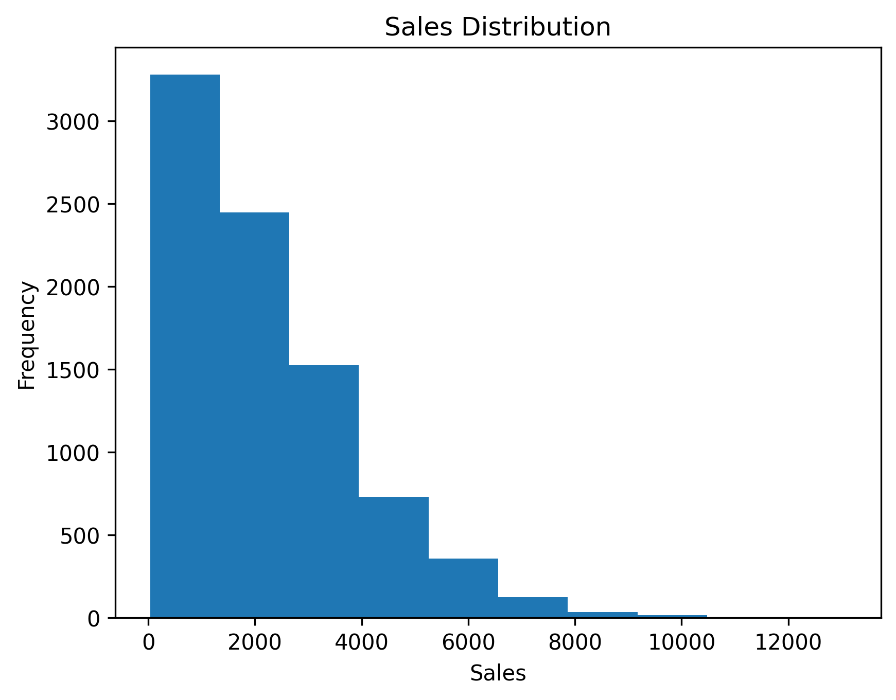
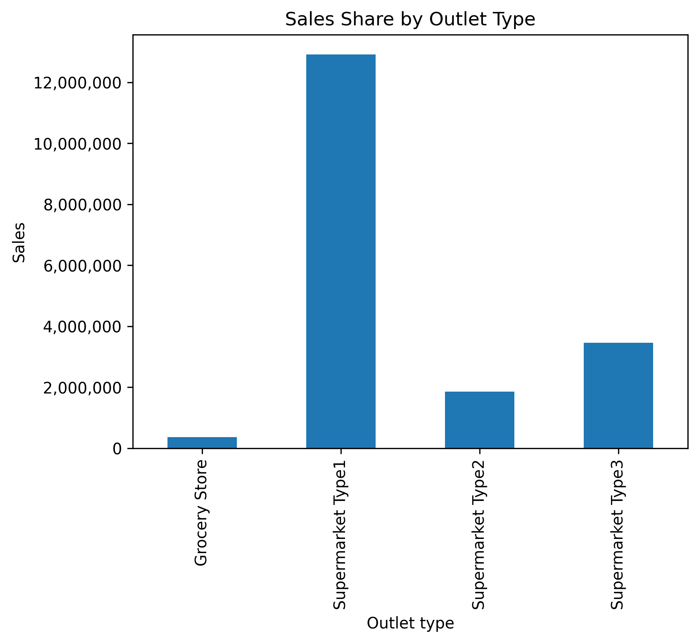
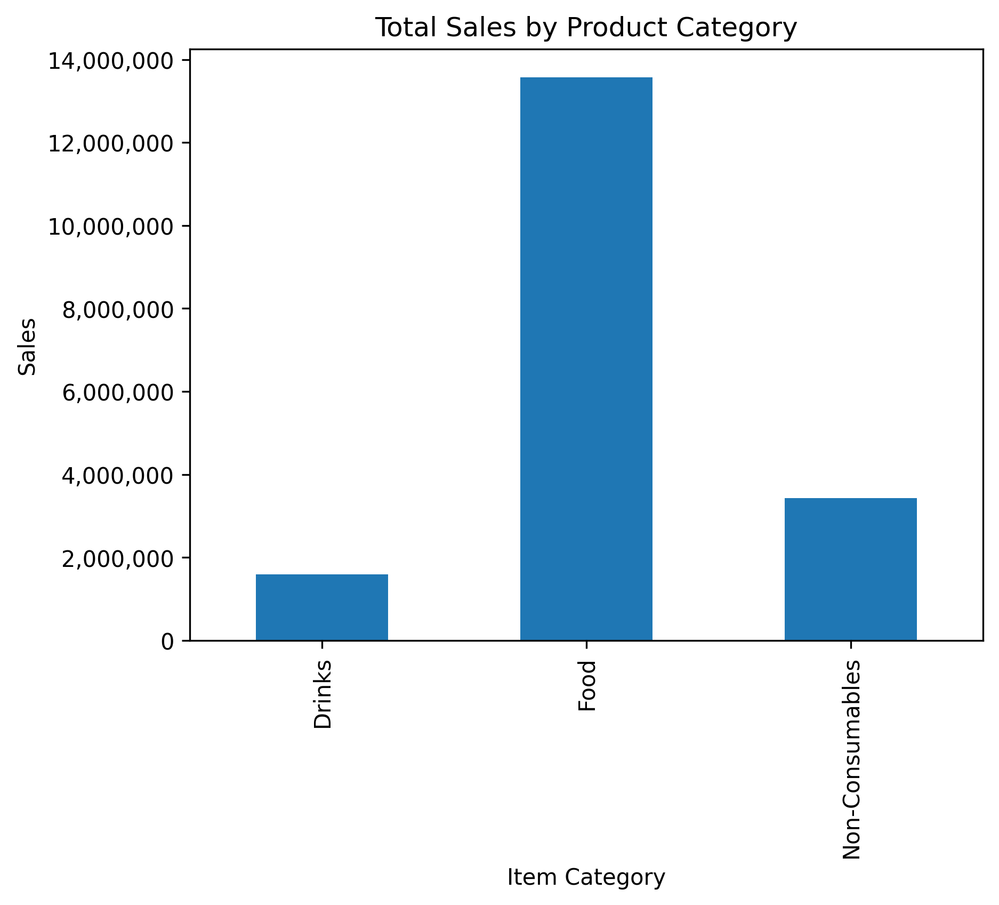
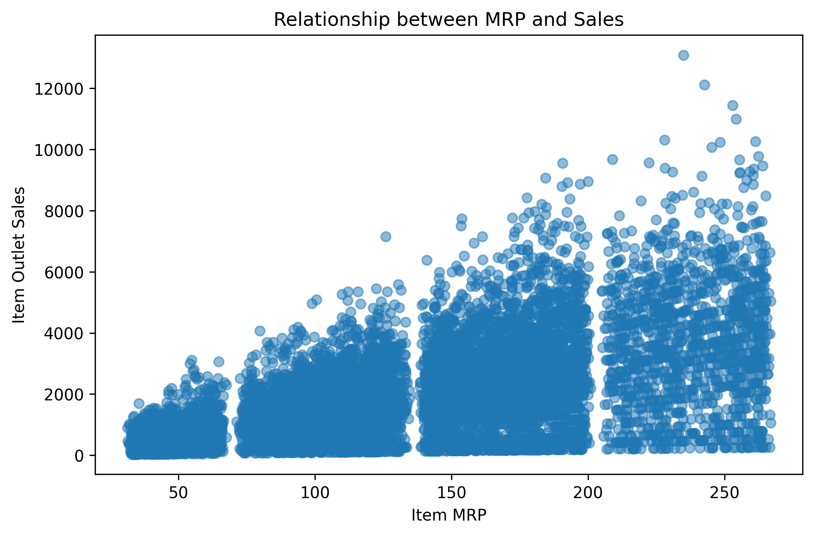
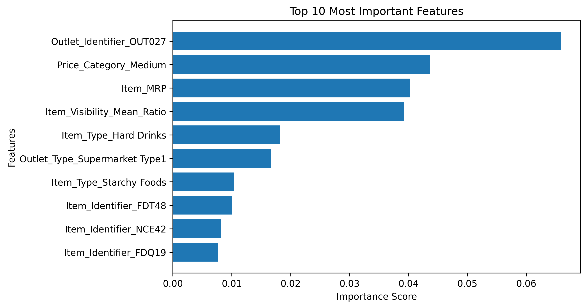

# BigMart-AI-Analyst
An end-to-end retail sales analytics and forecasting project that leverages Python, exploratory data analysis (EDA), feature engineering, business intelligence techniques, and XGBoost to generate actionable business insights and predict product sales.

## 📌 Project Overview

This project analyzes retail sales data from BigMart to uncover business insights, evaluate outlet and product performance, and build a machine learning model for predicting product sales. The project follows a complete data analytics workflow—from data preprocessing and exploratory analysis to model development and evaluation.

## 🎯 Objectives
- Analyze retail sales data to identify key business trends.
- Perform data cleaning and feature engineering.
- Generate KPIs and business insights through exploratory data analysis.
- Build and compare multiple machine learning models for sales prediction.
- Select the best-performing model for forecasting product sales.

## 📂 Dataset
The project uses the BigMart Sales Prediction dataset.

The dataset contains information about products, outlets, item visibility, product categories, outlet characteristics, and historical sales.

Files:
- train.csv
- test.csv
- sample_submission.csv

## 🛠️ Technologies Used
- Python
- Pandas
- NumPy
- Matplotlib
- Scikit-learn
- XGBoost
- Google Colab

## 🔄 Project Workflow
Dataset
   ↓
Data Cleaning
   ↓
Feature Engineering
   ↓
Exploratory Data Analysis
   ↓
Business Insights
   ↓
KPI Analysis
   ↓
Executive Summary
   ↓
Model Training
   ↓
Model Comparison
   ↓
XGBoost (Best Model)
   ↓
Sales Prediction

## 📊 Key Performance Indicators
- Total Sales
- Average Sales
- Median Sales
- Highest Selling Outlet
- Best Selling Product Category
- Average Item MRP
- Outlet-wise Revenue

## 📈 Exploratory Data Analysis

### 📊 Sales Distribution

**Insight:** The sales distribution is positively skewed, with most products generating moderate sales and a few products achieving exceptionally high sales.

### 🏪 Sales by Outlet Type

**Insight:** Supermarket Type 1 contributes the largest share of total sales, indicating it is the highest-performing outlet format.

### 🛒 Sales by Item Category

**Insight:** Fruits & Vegetables and Snack Foods are among the highest revenue-generating product categories.

### 💰 Item MRP vs Sales

**Insight:** Products with higher MRP generally tend to achieve higher sales, although the relationship is not perfectly linear.

### 🔗 Correlation Heatmap

**Insight:** Item_MRP has the strongest positive correlation with Item_Outlet_Sales, while Item_Visibility shows only a weak relationship.

## 💡 Key Business Insights
- Supermarket Type 1 generated the highest overall sales.
- Tier 3 outlets outperformed Tier 1 outlets.
- Fruits and Vegetables contributed the highest revenue.
- Higher MRP products generally achieved greater sales.
- Item Visibility showed only a weak relationship with sales.

## 🤖 Machine Learning Models
| Model | Purpose | 
|----------|----------|
| Linear Regression  | Baseline model   | 
| Decision Tree   | Non-linear prediction   |
| Random Forest | Ensemble learning |
| XGBoost | Final selected model |

## 🏆 Model Performance
| Model | MAE | RMSE | R² Score |
|-------|-----:|------:|---------:|
| Linear Regression | 943.67 | 1273.01 | 0.40 |
| Decision Tree | 1014.51 | 1465.67 | 0.21 |
| Random Forest | 762.12 | 1090.20 | 0.56 |
| XGBoost | 748.66 | 1077.52 | 0.57 |

### Conclusion

Among all the models evaluated, **XGBoost** achieved the lowest MAE and RMSE while obtaining the highest R² score. Therefore, it was selected as the final model for predicting BigMart product sales due to its superior predictive performance.

## ⭐ Feature Importance
The XGBoost model identifies the most influential features contributing to sales prediction.

### Key Findings

- **Item_MRP** is one of the strongest predictors of product sales.
- **Outlet_Type** and **Outlet_Identifier** also have significant influence on sales predictions.
- Features with lower importance contribute less to the model's decision-making process.

## 🚀 Future Improvements
- Develop an interactive Streamlit dashboard.
- Enable users to upload their own sales datasets.
- Integrate an LLM to generate automated executive summaries.
- Add demand forecasting for future inventory planning.
- Deploy the application on the cloud.

## 👩‍💻 Author
Vrinda Gaur

Aspiring Data Analyst | Python | SQL | Power BI | Machine Learning
